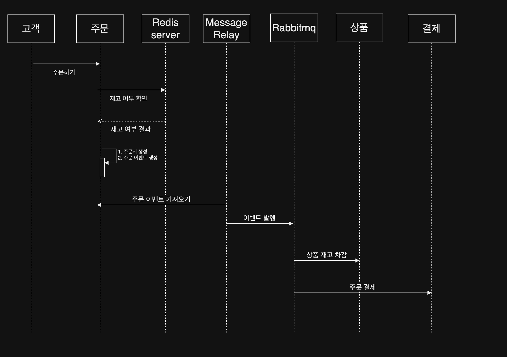

## MSA 기반 주문하기 시스템

### 개요
이커머스의 주문하기 구현, 기능 구현 시, 데이터 정합성, 에러 상황 대처에 중점

### 목표
- 이커머스 주문 가능
- 주문 완료 조회가 가능해야 함
- 주문 요청 시, 주문 내역 적재
- 모든 주문은 주문 코드에 의해 추적 가능

### 사용 기술
Java, Spring Boot, Spring Data JPA, Spring Cloud Gateway, MySql, Redis, Rabbitmq

### ERD

### Sequence Diagram

### 아키텍쳐
- 전체 서버 아키텍쳐

- 주문하기 아키텍쳐

