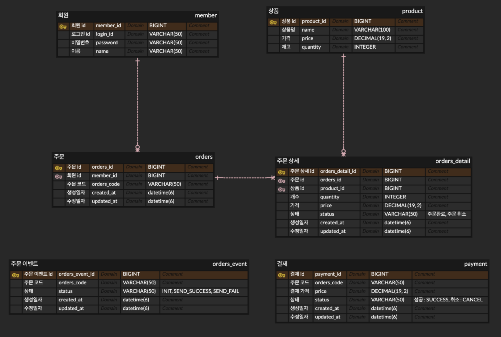
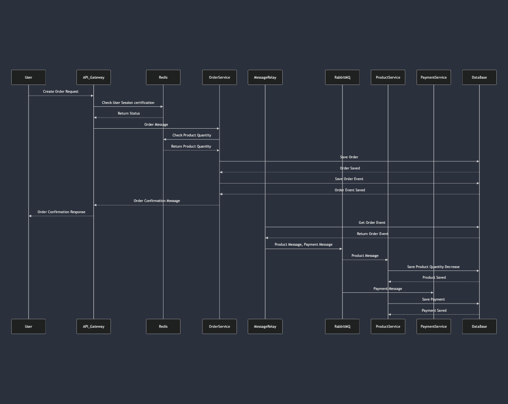
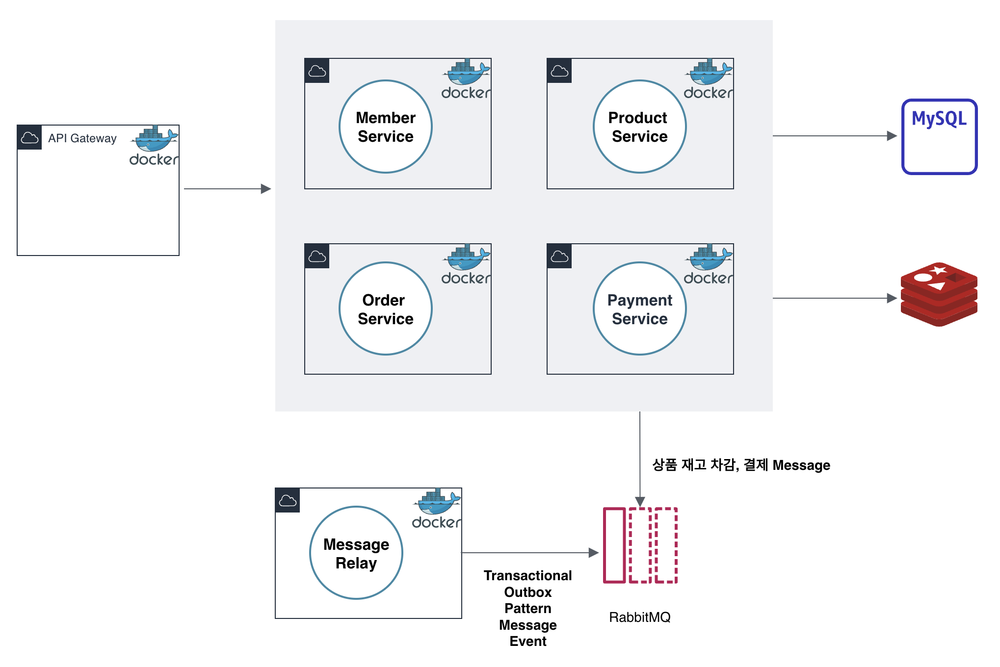

## MSA 기반 주문하기 시스템

### 개요
이커머스의 주문하기 구현, 기능 구현 시, 데이터 정합성, 에러 상황 대처에 중점

### 목표
- 이커머스 주문 가능
- 주문 완료 조회가 가능해야 함
- 주문 요청 시, 주문 내역 적재
- 모든 주문은 주문 코드에 의해 추적 가능

### 사용 기술
Java, Spring Boot, Spring Data JPA, Spring Cloud Gateway, MySql, Redis, Rabbitmq

### 모듈

- Domain 모듈은 비즈니스 모듈로 외부 요소에 따른 변경이 되지 않게 한다.
- Storage는 Domain 모듈를 의존한다.
- API 모듈은 Domain 모듈을 의존, Storage 모듈은 Runtime 때 동적으로 가져온다.

### ERD

### Sequence Diagram

- Gateway에서 회원 인증 검증
- OrderService는 Redis에서 상품 재고 검증
- Transactional Outbox Pattern 적용, Message Relay를 통해 Message Event RabbitMQ에 전달

### 아키텍쳐
- 전체 서버 아키텍쳐

### 개발 일대기

- [#1 이커머스 주문 하기 성능 개선기, 프로젝트 소개](https://github.com/zzangoobrother/study-organization/blob/main/project/ecommerce/1.%20%EC%9D%B4%EC%BB%A4%EB%A8%B8%EC%8A%A4%20%EC%A3%BC%EB%AC%B8%20%ED%95%98%EA%B8%B0%20%EC%84%B1%EB%8A%A5%20%EA%B0%9C%EC%84%A0%EA%B8%B0%2C%20%ED%94%84%EB%A1%9C%EC%A0%9D%ED%8A%B8%20%EC%86%8C%EA%B0%9C.md)
- [#2 이커머스 주문 하기 성능 개선기, 데이터 정합성](https://github.com/zzangoobrother/study-organization/blob/main/project/ecommerce/2.%20%EC%9D%B4%EC%BB%A4%EB%A8%B8%EC%8A%A4%20%EC%A3%BC%EB%AC%B8%20%ED%95%98%EA%B8%B0%20%EC%84%B1%EB%8A%A5%20%EA%B0%9C%EC%84%A0%EA%B8%B0%2C%20%EB%8D%B0%EC%9D%B4%ED%84%B0%20%EC%A0%95%ED%95%A9%EC%84%B1.md)
- [#3 이커머스 주문 하기 성능 개선기, 동시성 처리](https://github.com/zzangoobrother/study-organization/blob/main/project/ecommerce/3.%20%EC%9D%B4%EC%BB%A4%EB%A8%B8%EC%8A%A4%20%EC%A3%BC%EB%AC%B8%20%ED%95%98%EA%B8%B0%20%EC%84%B1%EB%8A%A5%20%EA%B0%9C%EC%84%A0%EA%B8%B0%2C%20%EB%8F%99%EC%8B%9C%EC%84%B1%20%EC%B2%98%EB%A6%AC.md)
- [#4 이커머스 주문 하기 성능 개선기, Distributed Lock](https://github.com/zzangoobrother/study-organization/blob/main/project/ecommerce/4.%20%EC%9D%B4%EC%BB%A4%EB%A8%B8%EC%8A%A4%20%EC%A3%BC%EB%AC%B8%20%ED%95%98%EA%B8%B0%20%EC%84%B1%EB%8A%A5%20%EA%B0%9C%EC%84%A0%EA%B8%B0%2C%20Distributed%20Lock.md)
- [#5 이커머스 주문 하기 성능 개선기, feign](https://github.com/zzangoobrother/study-organization/blob/main/project/ecommerce/5.%20%EC%9D%B4%EC%BB%A4%EB%A8%B8%EC%8A%A4%20%EC%A3%BC%EB%AC%B8%20%ED%95%98%EA%B8%B0%20%EC%84%B1%EB%8A%A5%20%EA%B0%9C%EC%84%A0%EA%B8%B0%2C%20feign.md)
